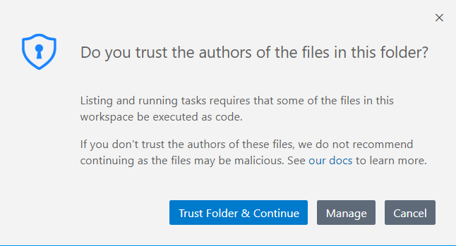
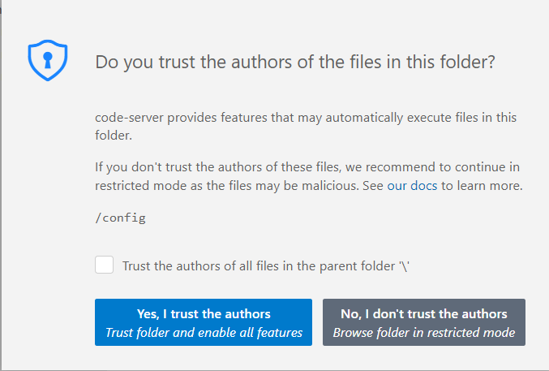
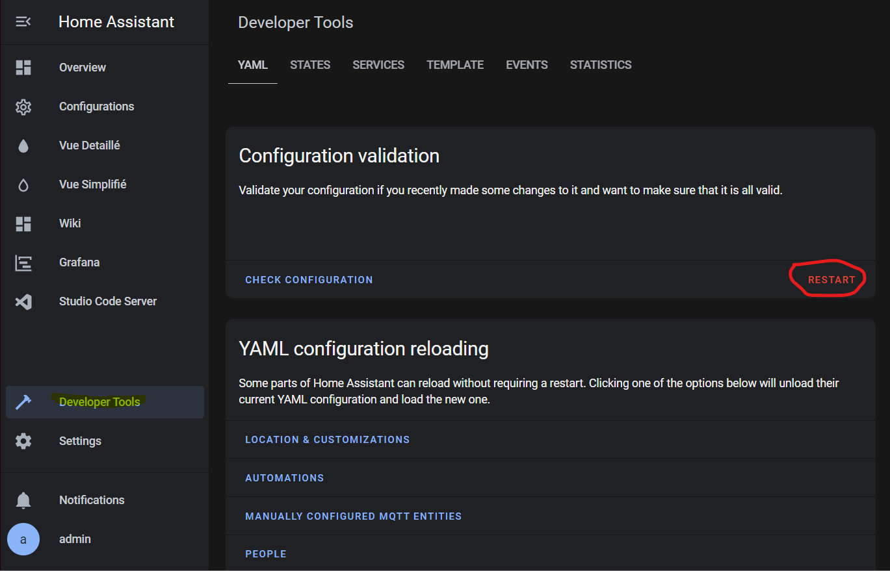
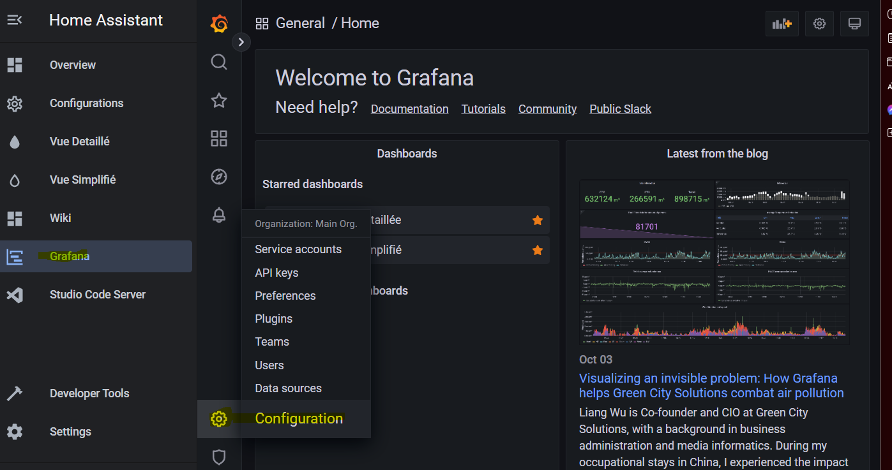
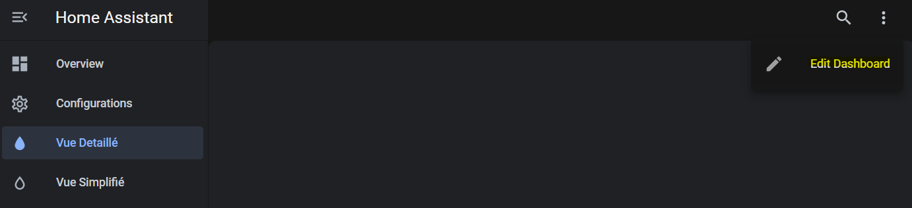
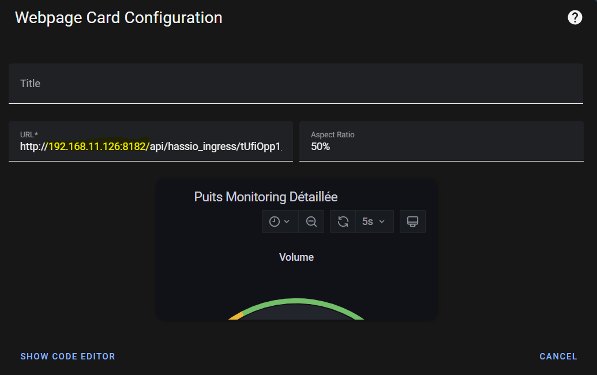
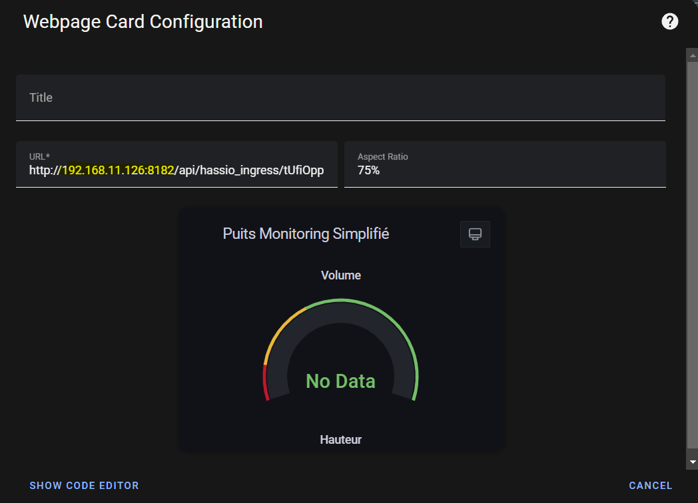

# Configuration de Home Assistant

**Dans cette étape, nous allons configurer l'interface Home Assistant afin d'être prêt à recevoir les données du puits via MQTT**

## Étape 1

Dans un premier temps, nous allons aller changer l'adresse IP qui sont dans la configuration de Home Assistant.\
Pour ce faire, allez dans Studio Code Server.\
Faites **Trust Folder & Continue** et **Yes, I trust the authors**

<figure><figcaption></figcaption></figure>

<figure><figcaption></figcaption></figure>

## Étape 2

Allez dans **configuration.yaml** et recherchez la section **influxdb**. Dans cette section, vous allez apercevoir le paramètre **host**. Enlevez cette adresse IP et mettez celle qui est associé à votre serveur Home Assistant. **(Pour rappel, vous pouvez voir l'adresse IP directement dans la machine virtuelle ou dans le URL)**

<figure><figcaption></figcaption></figure>

## Étape 3

Allez dans **Developer Tools** et faites **Restart** afin de mettre à jour nos changements.

<figure><figcaption></figcaption></figure>

## Étape 4

Allez dans le add-on Grafana et cliquez sur Configuration

<figure><figcaption></figcaption></figure>

## Étape 5

Cliquez maintenant sur la source de donnée InfluxDB pour pouvoir faire les changements nécessaires.

<figure><figcaption></figcaption></figure>

## Étape 6

Changez maintenant l'adresse IP pour celle de votre serveur Home Assistant.

<figure><figcaption></figcaption></figure>

## Étape 7

Défilez jusqu'à la fin de la page et faites Save & Test. Si tout fonctionne, vous allez apercevoir un message avec un crochet vert disant que ça fonctionne comme sur la capture d'écran ci-dessous.

<figure><figcaption></figcaption></figure>

## Étape 8

Maintenant, nous allons changer les adresses IP qui sont assignés à les cartes sur le tableau de bord. Pour ce faire, allez dans **Vue Detaillé** et cliquez sur **Edit Dashboard**.

<figure><figcaption></figcaption></figure>

## Étape 9

Cliquez maintenant sur **Edit** en bas à gauche de votre écran.

<figure><figcaption></figcaption></figure>

## Étape 10

Remplacer maintenant l'adresse IP dans le URL par celui de votre serveur.

<figure><figcaption></figcaption></figure>

## Étape 11

Faire la même étape que la précedente mais pour la **Vue Simplifié.**

<figure><figcaption></figcaption></figure>

#### Vous avez maintenant configuré Home Assistant afin d'avoir des jauges et des graphiques de nos données reçues!
