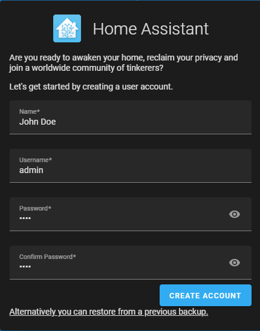

# Création de la machine virtuelle de Home Assistant

**Pour la création d'une machine virtuelle, l'utilisateur doit avoir:**

1. Ordinateur agissant comme serveur
   * 2 GO de RAM
   * 32 GO d'espaces disque
   * 2vCPU
2. Logiciel de virtualisation (Ex: **VMWare, VirtualBox**)

[**VirtualBox**](https://www.virtualbox.org) (Gratuit) [**VMWare Workstation**](https://www.vmware.com/ca/products/workstation-pro/workstation-pro-evaluation.html) (Nécessite une licence)

_**Dans le cas présent, l'installation se fera sous Windows 10 avec le logiciel de virtualisation VirtualBox**_

## Étape 1

Dépendamment du système d'exploitation utilisé, installez la version VM [**Home Assistant Operating System**](https://www.home-assistant.io/installation/).

## Étape 2

Choississez la bonne version de VM selon votre logiciel de virtualisation. Dans notre cas, ça sera le .vdi

<figure><figcaption></figcaption></figure>

## Étape 3

Dézippez le fichier que vous venez de télécharger et ouvrez VirtualBox pour créer une nouvelle machine virtuelle.

<figure><figcaption></figcaption></figure>

## Étape 4

Nommez votre machine virtuelle comme vous le souhaitez. Change le type pour **Linux** et la version pour **Linux 2.6/3.x/4.x (64-bit)** Cliquez **Next.**

<figure><figcaption></figcaption></figure>

## Étape 5

Mettez minimalement 2048 Mo (2 Go) pour la mémoire RAM.

<figure><figcaption></figcaption></figure>

## Étape 6

Sélectionnez "Use an existing virtual hard disk file" et recherchez votre fichier décompressé afin de le sélectionner.

<figure><figcaption></figcaption></figure>

## Étape 7

Sélectionnez votre machine virtuelle Home Assistant et cliquez sur **Settings.**

<figure><figcaption></figcaption></figure>

Dans **System**/**Motherboard**, activez la fonctionnalité **Enable EFI.**

<figure><figcaption></figcaption></figure>

## Étape 8

Toujours dans la fenêtre **Settings**, allez dans **Network** pour sélectionner **Bridge Adapter.**

<figure><figcaption></figcaption></figure>

## Étape 9

Allez maintenant dans l'onglet **Audio** pour changer le contrôlleur audio pour **Intel HD Audio.**

<figure><figcaption></figcaption></figure>

## Étape 10

Vous pouvez maintenant lancer votre machine virtuelle et attendre son démarrage jusqu'à l'apparition de cette écran:

<figure><figcaption></figcaption></figure>

## Étape 11

Vous pouvez désormais ouvrir votre navigateur préféré et accédez à l'adresse indiqué sur la machine virtuelle. http://homeassistant.local:8123.

## Étape 12

Attendez que la machine ait terminé de se préparer.

<figure><figcaption></figcaption></figure>

## Étape 13

Lorsque la procédure est terminé, vous pouvez créer votre compte pour votre Home Assistant.

<figure><figcaption></figcaption></figure>

## Étape 14

Choississez vos réglages pour l'étape suivante comme sur la photo ci-dessous:

<figure><figcaption></figcaption></figure>

## Étape 15

Laissez les options décochées et cliquez sur **Next.**

<figure><figcaption></figcaption></figure>

### Voilà, vous avez désormais votre Home Assistant fonctionnel!

#### Sources:

* https://www.home-assistant.io/installation/
* https://www.virtualbox.org
* https://www.vmware.com
