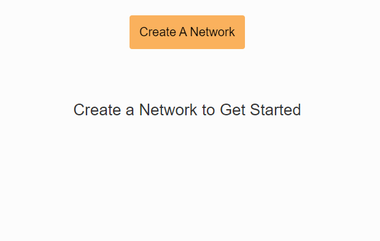
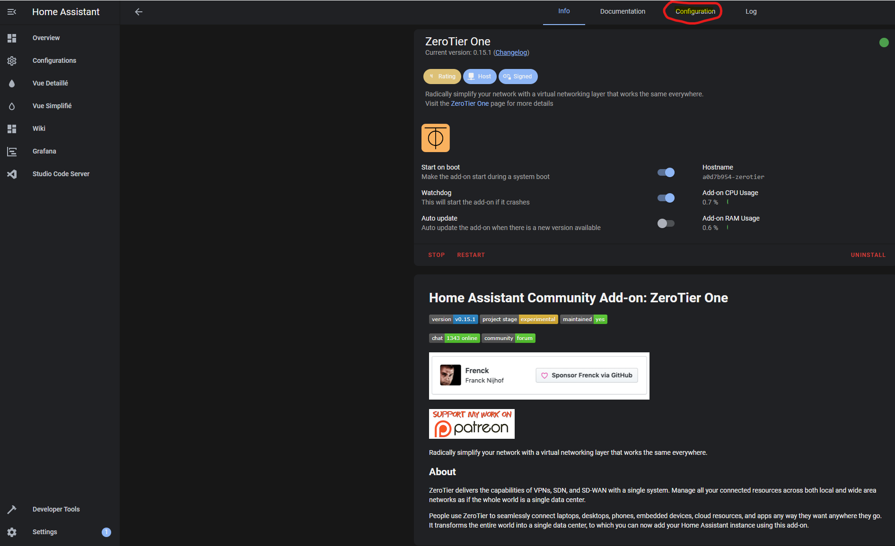
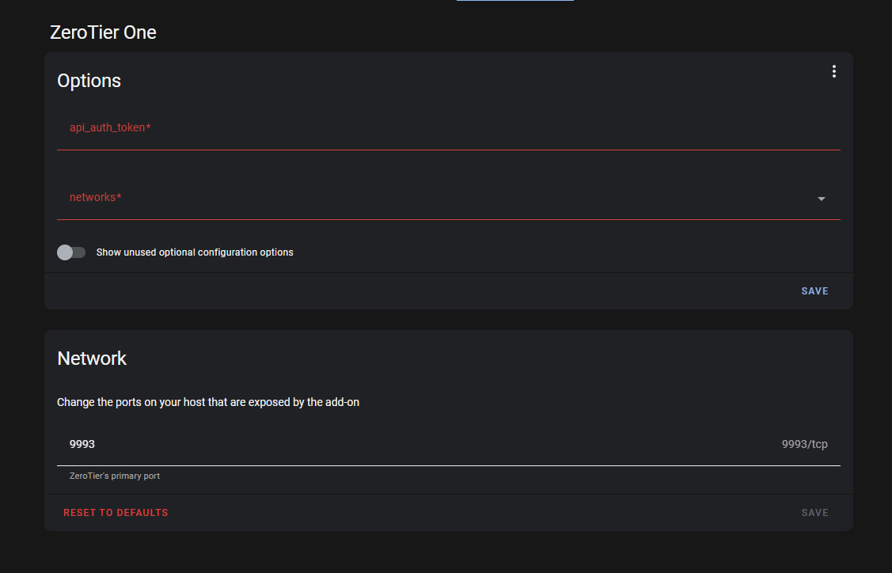
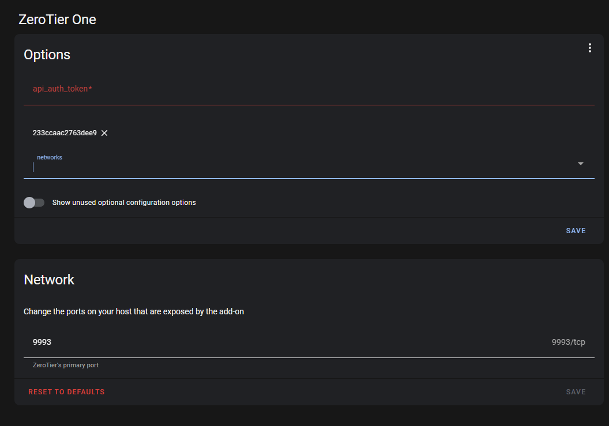
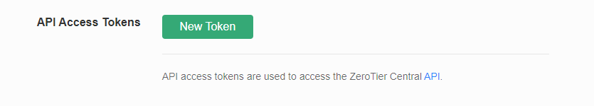
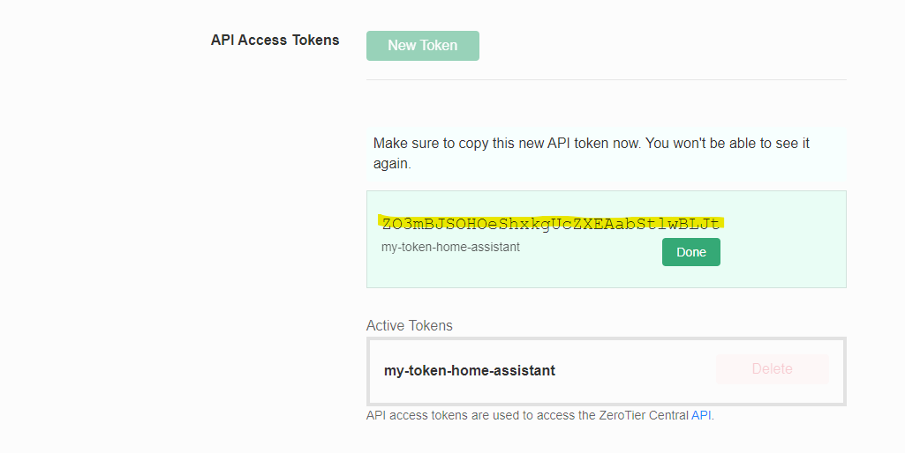
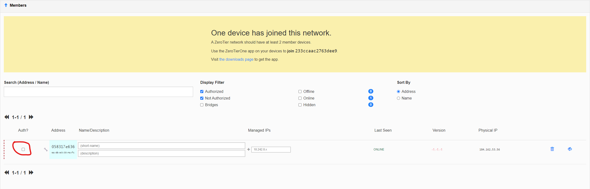

# Se connecter à distance à Home Assistant avec ZeroTier

**Afin d'avoir les données sous la main peu importe l'endoit où vous êtes, nous allons donc intégrer ZeroTier One afin de combler ce besoin.**

## Étape 1

Vous devez vous créer un compte sur [Zerotier](https://my.zerotier.com/)

## Étape 2

Une fois créé, vous devez cliquer sur **Create A Network**

<figure><figcaption></figcaption></figure>

## Étape 3

Lorsque c'est fait, vous apercevez maintenant votre nouveau réseau ZeroTier.\
_**Notez bien votre Network ID car nous allons l'utiliser dans les prochaines étapes.**_

<figure><figcaption></figcaption></figure>

## Étape 4

Retourner sur votre Home Assistant et allez dans Settings->Add-ons. En bas à droite, vous allez apercevoir un bouton **Add-on Store**.

<figure><figcaption></figcaption></figure>

Cliquez dessus et recherchez ensuite **ZeroTier One** afin de l'installer.

<figure><figcaption></figcaption></figure>

## Étape 5

Une fois le add-on ZeroTier One installé, nous allons donc devoir le configurer. Pour ce faire, cliquez sur l'onglet Configuration qu'on peut voir en haut au centre de l'écran comme sur l'image ci-dessous.

<figure><figcaption></figcaption></figure>

## Étape 6

Arrivé sur cette page, ZeroTier One demande donc un **api\_auth\_token** et un **network**.

<figure><figcaption></figcaption></figure>

Pour ce qui est du network, nous avons déjà notre Network ID que nous avons noté précédemment. C'est donc le moment de l'entrer dans le champ respectif. Dans mon cas, le id est donc le **233ccaac2763dee9**.

<figure><figcaption></figcaption></figure>

## Étape 7

Pour obtenir notre **api\_auth\_token**, nous devons retourner sur [Zerotier](https://my.zerotier.com/) et allez sur **Account.**

<figure><figcaption></figcaption></figure>

Une fois arrivé sur la page **Account**, vous allez voir un endroit indiqué **API Access Tokens**. Cliquez sur **New Token**, donnez lui un nom et cliquez sur **Generate.**

<figure><figcaption></figcaption></figure>

Cela va donc vous générer notre Token et donc nous allons pouvoir le copier dans la configuration précedente de ZeroTier One dans Home Assistant.

<figure><figcaption></figcaption></figure>

## Étape 8

Collez donc votre Token dans le champ respectif et cliquez sur **Save**. Cela va donc redémarrer votre Add-on afin de configurer les changements.

<figure><figcaption></figcaption></figure>

## Étape 9

Votre Home Assistant est donc ajouter à votre réseau ZeroTier, mais nous devons autorisé l'apparail à partir du tableau de bord de ZeroTier. Pour ce faire,\
retournez sur [Zerotier](https://my.zerotier.com/) et cliquez sur votre Network. Défilez dans la page et vous allez apercevoir une section **Members**. Dans cette liste, nous observons un appareil qui dit être "Online" mais n'est pas encore autorisé. Nous allons donc cocher la case qui est dans le cercle rouge comme sur l'image ci-dessous.

<figure><figcaption></figcaption></figure>

Une fois fait, notre réseau lui a donc assigné une adresse IP. Dans notre cas, l'adresse est donc 10.242.111.130. Nous pouvons aussi lui metter une description afin de se souvenir de l'appareil.

<figure><figcaption></figcaption></figure>

## Étape 10

Afin de pouvoir intéragir avec Home Assistant sur le réseau ZeroTier, nous devons donc ajouter un/des appareil(s) de notre choix afin d'y installer ZeroTier One. Une fois installé sur votre device préféré, vous pouvez donc lui ajouter le Network ID de votre réseau, ensuite retournez sur le tableau de bord de ZeroTier afin d'autorisé le device fraîachement ajouté en cochant la case. (Comme dans l'étape 9)

Voici la liste des appareils pouvant installer ZeroTier One :\
[Android](https://play.google.com/store/apps/details?id=com.zerotier.one)\
[IOS](https://itunes.apple.com/us/app/zerotier-one/id1084101492?mt=8)\
[Windows](https://download.zerotier.com/dist/ZeroTier%20One.msi)\
[MacOS](https://download.zerotier.com/dist/ZeroTier%20One.pkg)\
[Linux](https://www.zerotier.com/download/)

## Étape 11

À partir de votre appareil dont vous avez installé l'application ZeroTier One et configuré sur votre réseau ZeroTier, vous pouvez maintenant accéder à votre Home Assistant à l'aide de son adresse IP assigné par Zerotier. Dans notre cas, le serveur pourrait être accéder via [http://10.242.111.130:8123](http://10.242.111.130:8123/) .

**Vous pouvez désormais vous connecter à votre Home Assistant peu importe où que vous êtes dans le monde!**
