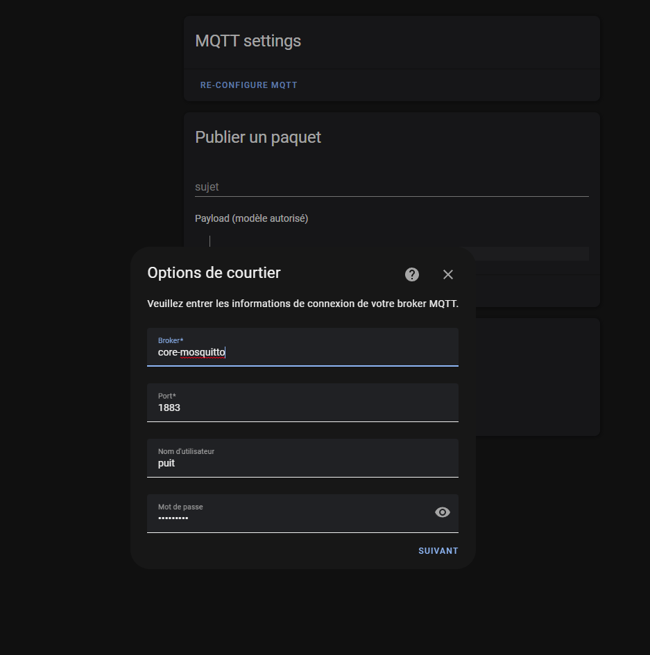

# Mosquitto Broker (Intrégration)

Grâce à ceci, le ESP et Home Assistant peuvent communiquer en se partageant des données souhaitées. Cette ingrégration permet donc d'interagir avec le add-on Mosquitto Broker afin de pouvoir créer le nom du broker, le nom d'utilisateur et le mot de passe afin de pouvoir communiquer avec lui de l'externe.

<figure><figcaption></figcaption></figure>
